# Manga Translator

A framework for translating Japanese manga into the desired language. Currently supports English and Chinese.

Features:
- Segmentation model that extracts texts from manga pages
- OCR model for identifying segmented texts
- Translation model 
- A formatter that displays the translated texts in the text bubbles


Some base code is borrowed from: https://github.com/ttop32/JMTrans. Notable changes/improvements:
- Better [segmentation model](https://github.com/juvian/Manga-Text-Segmentation), which is based on ResNet34.
- Better [OCR model](https://github.com/kha-white/manga-ocr), which is based on ViT.
- Changed translation APIs (`googletrans` and `google_trans_new` no longer works, AFAIK).
- Some hacks to improve English text formatting 
- More detailed documentations


## Updates

### 1/19/2023
- Added merged font that supports formatting special characters on the page, e.g., 〜, ♪. 
- Added filtering mechanism to cull out text boxes that in fact have no texts, which improves OCR and final results.
- Added options to use CPU in the case of large images causing excessive GPU memory usage.


## Example Results

<!-- | [Original](https://tonarinoyj.jp/episode/316190247048704205)  |
| ------------- | 
| 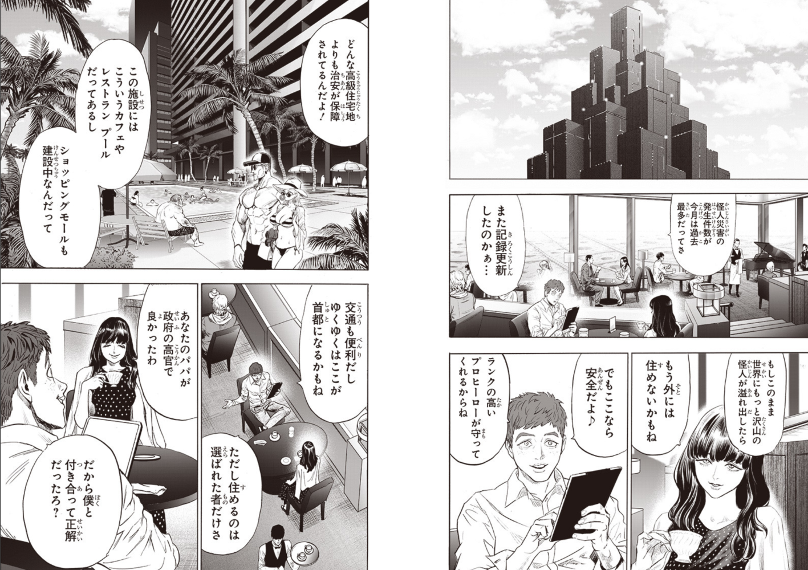  |

| Translated |
| ------------- | 
| 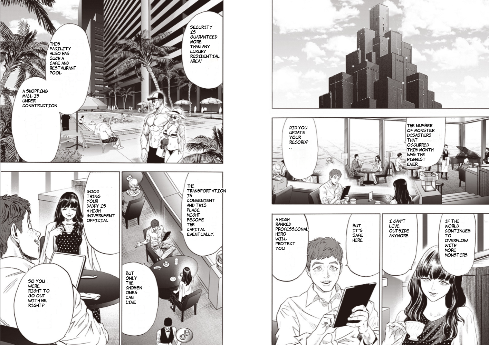  |  -->

### [Original](https://tonarinoyj.jp/episode/316190247048704205)


### Translated, English


### Translated, Chinese

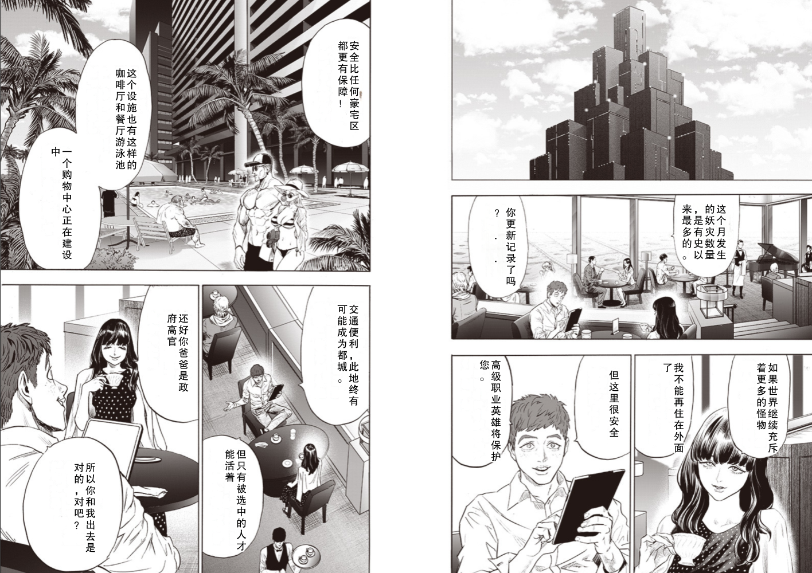

## Workflow

The general workflow goes as follows, same as https://github.com/ttop32/JMTrans:

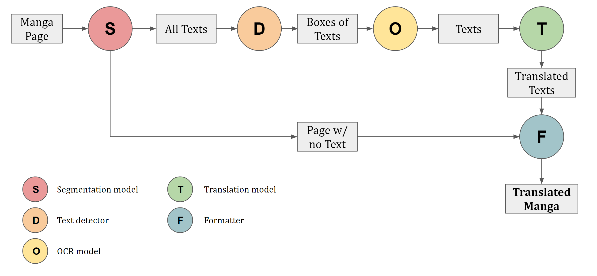


For the example page shown, the output of each step of the workflow is illustrated below, with English as the target language.

### Textless Original and Segmented Texts 


| Textless Page | Segmented Texts |
| ------------- | ------------- |
| 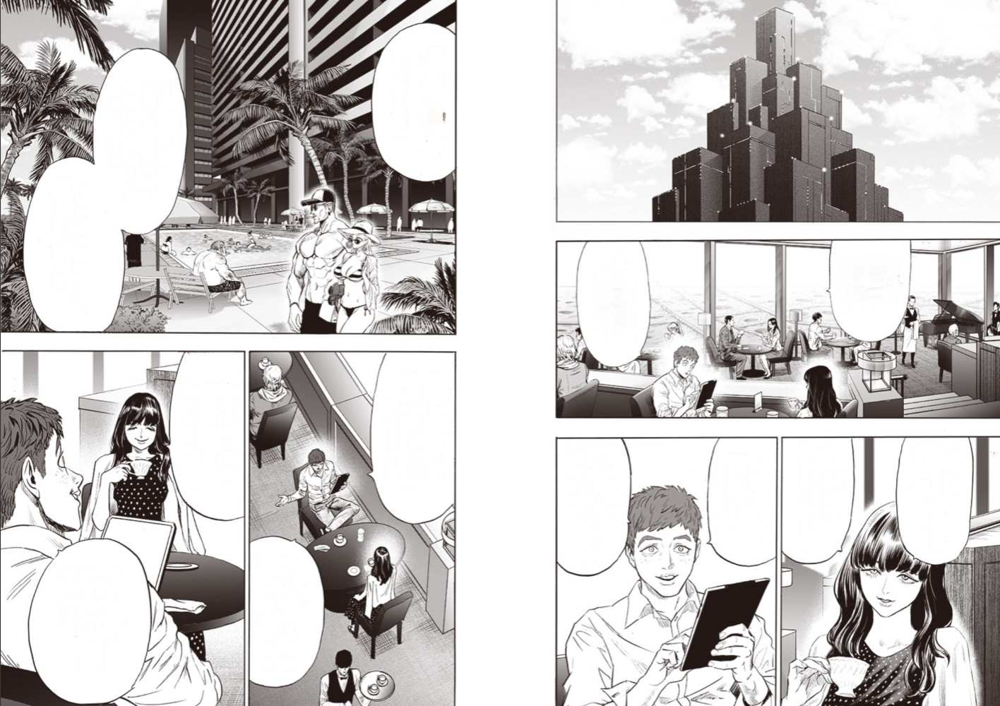  | 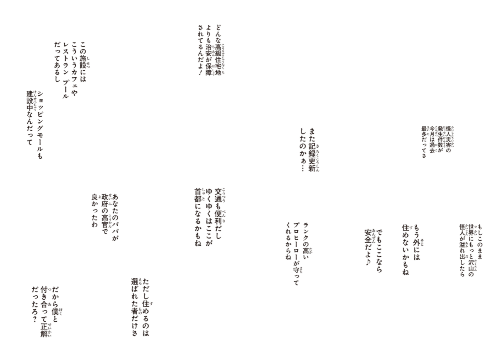  


### Detected Text Blocks, OCR Results, and Translated Texts

| Text Block | OCR Result | Translated Texts |
| ------------- | ------------- | ------------- |
| 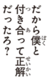 | だから僕と付き合って正解だったろ？ | So you were right to go out with me, right? 
| 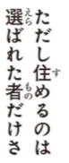 | ただし住めるのは選ばれた者だけさ | But only the chosen ones can live 
| 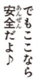 | でもここなら安全だよ♪ | But it's safe here 
| 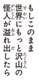 | もしこのまま世界にもっと沢山の怪人が溢れ出したら | If the world continues to overflow with more monsters 
| 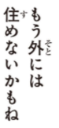 | もう外には住めないかもね | I can't live outside anymore
| 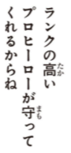 | ランクの高いプロヒーローが守ってくれるからね | A high-ranked professional hero will protect you.
| 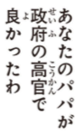 | あなたのパパが政府の高官で良かったわ | Good thing your daddy is a high government official
| 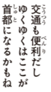 | 交通も便利だしゆくゆくはここが首都になるかもね | The transportation is convenient and this place might become the capital eventually.
| 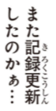 | また記録更新したのかぁ．．．| Did you update your record? . . 
| 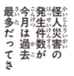 | 怪人災害の発生件数が今月は過去最多だってさ | The number of monster disasters that occurred this month was the highest ever.
| 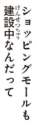 | ショッピングモールも建設中なんだって | A shopping mall is under construction 
| 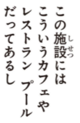 | この施設にはこういうカフェやレストランプールだってあるし | This facility also has such a cafe and restaurant pool 
| 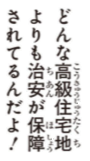 | どんな高級住宅地よりも治安が保障されてるんだよ！ | Security is guaranteed more than any luxury residential area! 


## Usage

The intended usage is to first have all the raw manga pages stored in a folder `manga` under the root directory, then run:

```
python manga_translator.py --raw_dir ./manga --result_dir_name test
```

All results generated during the translation can be found under `results/test`. In particular, the translated pages are located in `results/test/translated`.

To see all the available options and their usage, run

```
python manga_translator.py --help
```

### Parameters worth tuning

If the quality of the translated pages are less than desirable, it may be helpful to set the `--verbose` flag and inspect the additional debugging outputs, e.g., the individual text boxes, their OCR results, and the translated results in the `OCR` folder under the result dir.

Below lists some important parameters that may fix your issues with proper tuning:
- `--contour_size` controls the size of the element used to determine text boxes, expressed as a percentage of the image length. Essentially, a bigger contour size means the text boxes are more likely to join each other to form bigger text boxes. If the contour size is too small, then each text boxes will be broken into separate parts, and the OCR/translation quality will be bad. If the contour size is too big, then you have very large text boxes as unions of several blocks of text, which is also hard for OCR purposes.

- `--conf_filter_thres` controls the lower bound on the Tesseract OCR confidence before we deem the text box unfit for OCR purposes. A biggest value means more text blocks will get filtered out, and some legitimate texts may not be translated; a smaller value means some texts boxes that don't actually contain text may get included, which will be OCR-ed and translated, resulting in random texts floating around the page. A good balance for this value is important and depends somewhat on whether you rather leave texts untranslated or have nonsensible texts interfering with the drawing.

### Additional notes on individual modules.

#### Text Segmentation

In general, [Manga segmentation](https://github.com/juvian/Manga-Text-Segmentation) works like a charm.

#### OCR

[Manga OCR](https://github.com/juvian/Manga-Text-Segmentation) works great and is robust with respect to some noises on the background, i.e., if the text is not originally in a box with white background. However, all OCR tools struggle if multiple blocks of texts are joined together into a single box, so it is important to segment and detect the text boxes correctly prior to OCR.

#### Translator

Google translation is superior to the other options, and really the only sensible one in most cases.

#### Fonts

Some basic fonts are included in `lib_/fonts`. For English, [Komika](https://www.1001fonts.com/komika-font.html) is the closet free font I could find for a typical translated manga. Feel free to use your own fonts!


## Setup

### Hardware

In general, you need a machine with a decent GPU (Nvidia) to run the script, as the segmentation and OCR models eat up a decent amount of GPU memory. I tested it on a machine with i7-8700 and GTX 1080. 

### Dependencies
Run the following commands:

```
conda create -n manga_translator python=3.7

pip install tensorflow-gpu==1.15.0

pip install torch==1.10.1+cu102 torchvision==0.11.2+cu102 -f https://download.pytorch.org/whl/torch_stable.html

pip install argostranslate pytesseract manga-ocr

pip install requests PyQt5 tqdm funcy Pillow cefpython3 pywin32 matplotlib imageio google_trans_new beautifulsoup4 wget pyperclip astor==0.8.0 

conda install opencv

pip install --upgrade google-api-python-client google-auth-httplib2 google-auth-oauthlib pyinstaller==3.2.1

pip install fastai==1.0.60
```

Note for Pytorch:
- Tested on 1.10
- Change +cu102 to the CUDA version that you have installed. Ex: +cu111 = CUDA 11.1


**In addition, please follow the instructions below to set up the individual modules used.**


### Manga-Text-Segmentation

Download the pretrained model from: https://github.com/juvian/Manga-Text-Segmentation/releases/download/v1.0/fold.0.-.final.refined.model.2.pkl and put it in the `lib_/models` folder


### Tesseract OCR
Download and install Tesseract, add its root folder to PATH. It can then be used through pytesseract.


### Google Translation

#### API Setup

You need to set up the Google Cloud API, which takes ~10min if you follow the tutorial below. You would need to link a credit card to use the translation API - there is a (fairly generous) quota for the number of words you can freely translate each month. After that, you will be charged. Check the pricing link for details. 

After setting up the cloud API, you should have a key associated with your service account. Download a local copy and store it in a secure location, then change `os.environ["GOOGLE_APPLICATION_CREDENTIALS"]` in `text_translate.py` to the directory in which the key is stored. In addition, change `project_id` in the same file to be the one you picked for the cloud project. In the default case, another local json file is used to store this information.

#### References
- Official tutorial: https://codelabs.developers.google.com/codelabs/cloud-translation-python3#1

- Pricing: https://cloud.google.com/translate/pricing

#### Other notes
- If the error "google.api_core.exceptions.PermissionDenied: 403" pops up at step 7, go to IAM service section in the project, where you should see your own gmail account as well as the service account you just created. Edit the service acount and add a role called "Service Usage Consumer" to it.


### Potential Errors

#### TensorFlow

When importing tensorflow, the following error may appear:

TypeError: Descriptors cannot not be created directly.
If this call came from a _pb2.py file, your generated code is out of date and must 
be regenerated with protoc >= 3.19.0.
If you cannot immediately regenerate your protos, some other possible workarounds are:
 1. Downgrade the protobuf package to 3.20.x or lower.
 2. Set PROTOCOL_BUFFERS_PYTHON_IMPLEMENTATION=python (but this will use pure-Python parsing and will be much slower).

Cause: unclear, could be a problem between Python 3.7 and TF 1.14

Workaround:
https://github.com/docker-library/python/issues/731
pip uninstall protobuf
pip install --no-binary protobuf protobuf


#### Manga-Text-Segmentation

Error: `OMP: Error #15: Initializing libiomp5md.dll, but found libiomp5md.dll already initialized.`

This is a sticky one. One may try adding the following:

```
import os
os.environ["KMP_DUPLICATE_LIB_OK"]="TRUE"
```

However, this is an "unsafe, unsupported, undocumented workaround". 

The thread that resolved this is: https://stackoverflow.com/questions/20554074/sklearn-omp-error-15-initializing-libiomp5md-dll-but-found-mk2iomp5md-dll-a, in which deleting duplicated `libiomp5md.dll` files was suggested as a possibility. I deleted the one under `ENV_NAME\Lib\site-packages\torch\lib\libiomp5md.dll`, and everything is fixed.


## Future Works

Below lists some stuff that can use some improvements.

### Text Segmentation and OCR

Currently, the text segmentation tends to get some false positives, i.e., identifying non-texts as texts, which will subsequently get OCR-ed. The OCR engine also leans on the "imaginative" side, so it will try to decipher some texts even if the input has none. Overall, this means there will be some random translated texts floating around in the page. 

### Translation

It'd be great to find another offline translator that works better than argos. No luck so far.

It appears that translating into Chinese has worse quality than translating into English, which makes sense. I wonder if it'd be better to first translate into English, then Chinese (which had to be done for e.g., argos).

### Formatter

The main difficulty is that Japanese is formatted vertically, and we need to display the translated English texts horizatonally.  
    - Chinese can be displayed vertically as well, so it works better in this respect.

Currently there are some hacks that go into determining the areas to for drawing the translated texts, the text font sizes, etc. Not sure if the approach is general enough to work for all type of text bubbles.

### Efficiency

Benched on a machine with i7-8700, GTX 1080, and 32GB RAM, a page of 1000 x 1200 in size takes ~15 seconds. There is likely room for optimization here, such as processing the pages in parallel. 


### Misc.

The code currently outputs a ton of stuff from TF. It'd be nice to suppress these.

The project can use a `requirements.txt`.


## References

Segmentation
- [SickZil-Machine](https://github.com/KUR-creative/SickZil-Machine)
- [Manga-Text-Segmentation](https://github.com/juvian/Manga-Text-Segmentation)

OCR
- [Manga-OCR](https://github.com/kha-white/manga-ocr)
- [Japanese-OCR](https://github.com/nyorem/python-japanese-ocr)
- [Tesseract](https://github.com/tesseract-ocr/tesseract)

Translation
- [argos-translate](https://github.com/argosopentech/argos-translate)


