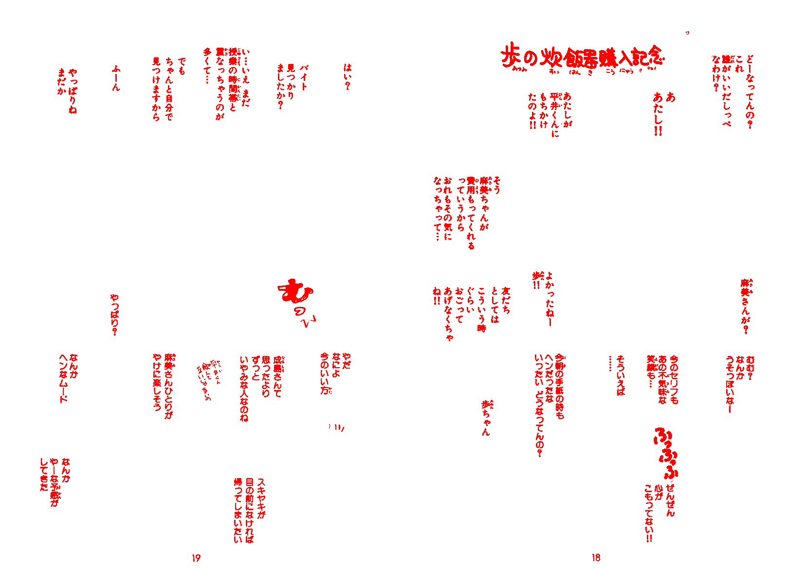

# Manga-Text-Segmentation
Official repo of our paper [Unconstrained Text Detection in Manga: a NewDataset and Baseline](https://link.springer.com/chapter/10.1007%2F978-3-030-67070-2_38).

## Example
Input:

Output:

<sup>(source: [manga109](http://www.manga109.org/en/), © Yoshi Masako)</sup>

## Dataset
Our label masks are available at [zenodo](https://zenodo.org/record/4511796). For the original Manga109 images, please refer to [Manga 109 website](http://www.manga109.org/en/).

## Code
The important notebooks that led to our best models are: **model** (resnet34 from modelDict) and **refine** (model/resnet34 path). The rest were either experiments or visualization. Check in notebook **extra** to view how predictions are loaded. 

## Try it out
You can try out predicting by opening the [Predict notebook](/examples/Manga_Text_Segmentation_Predict.ipynb) in colab.

## Additional Resources
A further extensive detail of our research can be found in [Arxiv](https://arxiv.org/abs/2010.03997). This includes more examples and other things we tried before reaching the end result explained in our paper.

## Citation
If you find this work or code is helpful in your research, please cite:
````
@InProceedings{10.1007/978-3-030-67070-2_38,
author="Del Gobbo, Juli{\'a}n
and Matuk Herrera, Rosana",
editor="Bartoli, Adrien
and Fusiello, Andrea",
title="Unconstrained Text Detection in Manga: A New Dataset and Baseline",
booktitle="Computer Vision -- ECCV 2020 Workshops",
year="2020",
publisher="Springer International Publishing",
address="Cham",
pages="629--646",
abstract="The detection and recognition of unconstrained text is an open problem in research. Text in comic books has unusual styles that raise many challenges for text detection. This work aims to binarize text in a comic genre with highly sophisticated text styles: Japanese manga. To overcome the lack of a manga dataset with text annotations at a pixel level, we create our own. To improve the evaluation and search of an optimal model, in addition to standard metrics in binarization, we implement other special metrics. Using these resources, we designed and evaluated a deep network model, outperforming current methods for text binarization in manga in most metrics.",
isbn="978-3-030-67070-2"
}

@dataset{segmentation_manga_dataset,
  author       = {julian del gobbo and
                  Rosana Matuk Herrera},
  title        = {{Mask Dataset for: Unconstrained Text Detection in 
                   Manga: a New Dataset and Baseline}},
  month        = feb,
  year         = 2021,
  publisher    = {Zenodo},
  version      = {1.0},
  doi          = {10.5281/zenodo.4511796},
  url          = {https://doi.org/10.5281/zenodo.4511796}
}
````
